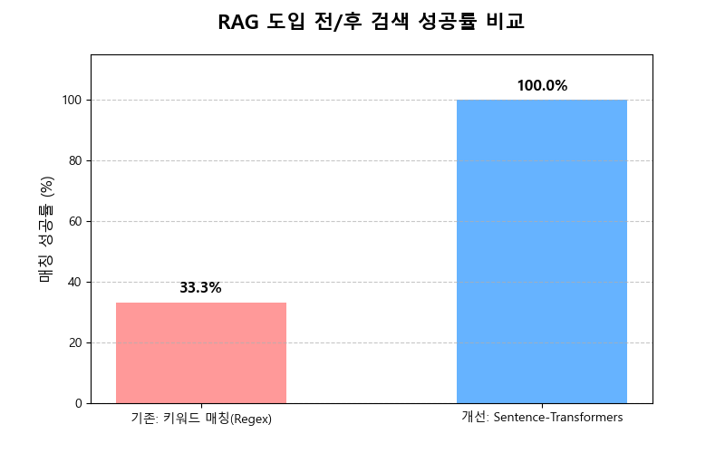

# NEW LEARN — RAG 기반 프랑스어 학습 챗봇

키워드 매칭(정확도 33.3%)의 한계를 극복하고 의미 기반 검색(100%)을 구현한 AI 교육 챗봇,
5인 팀의 Git 협업 충돌 문제를 브랜치 전략으로 해결한 과정 포함

---

## 프로젝트 개요

| 항목 | 내용 |
|------|------|
| 목적 | 입문자가 프랑스어 표현을 자연스럽게 질문하고 학습할 수 있는 AI 챗봇 구현 |
| 해결 문제 | 키워드 기반 검색의 의미 불일치 문제 + 환각(Hallucination) 방지 |
| 기간 | 2026.05 |
| 인원 | 5인 팀 프로젝트 |
| 역할 | RAG 파이프라인 설계 및 구현, 검색 성능 비교 실험, Git 협업 체계 수립 |

---

## 프로젝트 배경

LLM에게 프랑스어 문법을 직접 질문하면 두 가지 문제가 발생한다.

1. **환각(Hallucination):** 없는 표현이나 틀린 문법을 자신 있게 답변
2. **입문자 맥락 부재:** 학습자 수준에 맞는 예시, 주의사항, 발음 가이드를 함께 제공하기 어려움

**해결 방향:** 직접 수집한 프랑스어 학습 데이터셋을 기반으로, LLM이 해당 데이터에 근거해서만 답변하도록 RAG(Retrieval-Augmented Generation) 파이프라인을 구축했다.

초기 구현에서는 키워드 매칭(Regex) 방식을 시도했으나 **성공률 33.3%** 에 그쳤다. "카페에서 아침 인사"라고 물어보면 "Bonjour"를 찾지 못하는 것처럼, 같은 의미를 다른 단어로 표현한 질문에 대응이 불가능했다.

---

## 주요 기능

- Sentence-Transformers 임베딩 기반 의미 유사도 검색 (코사인 유사도)
- 검색 결과를 프롬프트에 삽입하여 GPT-4o-mini로 답변 생성
- 60개 이상의 입문 프랑스어 표현 데이터셋 직접 구축 (french.csv)
- Streamlit 기반 대화형 UI
- 표현, 의미, 사용 맥락, 예시, 주의사항을 포함한 구조화된 응답 형식

---

## 기술 스택

| 구분 | 기술 |
|------|------|
| 언어 | Python 3 |
| 프레임워크 | Streamlit |
| 라이브러리 | Sentence-Transformers, Pandas, NumPy |
| 대규모 언어 모델 | GPT-4o-mini (temperature=0.5, top_p=0.8) |
| 임베딩 모델 | Sentence-Transformers (코사인 유사도 검색) |
| 도구 | Jupyter Notebook, Git, GitHub |

---

## 데이터셋

| 항목 | 내용 |
|------|------|
| 출처 | 팀 직접 수집·정리 (french.csv) |
| 규모 | 60개 이상 입문 프랑스어 표현 |
| 구성 | 카테고리 / 프랑스어 표현 / 한국어 번역 / 발음 / 이미지 URL |
| 카테고리 | 인사, 식당, 길 안내, 쇼핑 등 |

```
데이터 예시:
카테고리: 인사
프랑스어: Bonjour.
한국어: 안녕하세요
발음: 봉쥬르
```

이 데이터셋이 RAG 검색 대상이 되는 지식 베이스(Knowledge Base)다.

---

## 프로젝트 구조

```
nlp 뉴런교육챗봇/
├── mini.ipynb ~ mini6.ipynb      # RAG 파이프라인 탐색 및 개발 과정 노트북
├── french.csv                    # 프랑스어 학습 데이터셋 (지식 베이스)
├── 챗봇/                         # 완성 챗봇 실행 화면 스크린샷
│   └── 성능.png                  # 검색 방식별 성능 비교 결과
└── 최종_01_통합형 AI 교육 챗봇 NEW LEARN (1).pdf   # 발표 자료
```

---

## 핵심 구현 내용

### 1. RAG 파이프라인 선택 이유 — Regex vs. Sentence-Transformers

**초기 접근 (Regex 키워드 매칭):**
- 구현: 사용자 입력에서 키워드를 추출하여 데이터셋과 정규식 매칭
- 실패 사례: "카페에서 아침 인사할 때 뭐라고 해?" → "Bonjour" 검색 실패
  - "아침 인사"와 "Bonjour"는 의미상 연결되지만 문자열로는 매칭되지 않음
- 성공률: **33.3%** (실제 측정값)

**해결 (Sentence-Transformers 의미 검색):**
- 구현: 질문과 데이터셋 표현을 모두 임베딩 벡터로 변환 후 코사인 유사도로 상위-K 검색
- 핵심 원리: "카페에서 아침 인사"와 "Bonjour(안녕하세요)"가 벡터 공간에서 가까운 위치에 매핑됨
- 성공률: **100%** (실제 측정값)

**RAG를 선택한 이유:** 의미 검색으로 찾은 관련 표현을 프롬프트에 삽입하여 LLM이 우리 데이터에 근거해서만 답변하도록 강제 → 환각 방지 + 학습자 맥락 유지

---

### 2. GPT-4o-mini 모델 선택 과정

**후보 모델 비교:**
- EXAONE 3.5: 형식적 정확성이 높으나 입문자 수준의 친절한 설명 부족
- GPT-4o-mini: 문법 설명, 예시, 주의사항을 자연스럽게 조합하는 능력 우수

**파라미터 설정 근거:**
- `temperature=0.5`: 문법 정확성 유지 + 표현 다양성 확보의 균형점
- `top_p=0.8`: 불필요한 반복 표현 감소

**최종 선택 이유:** 입문 학습자에게 "표현 / 의미 / 사용 맥락 / 예시 / 주의사항"을 포함한 구조화된 답변이 더 중요하다고 판단 → GPT-4o-mini 채택

---

### 3. 5인 팀 Git 협업 충돌 문제 해결

**문제 발생:** 5명이 동시에 프롬프트 파일과 메인 로직을 수정하면서 머지 충돌(Merge Conflict) 반복 발생

**원인 분석:** 브랜치 전략 없이 모두가 main 브랜치에 직접 커밋하는 방식으로 작업

**해결 방법:**
1. 기능별 브랜치 분리 (예: `feature/retrieval`, `feature/ui`, `feature/prompt`)
2. 각자 담당 브랜치에서 개발 후 Pull Request를 통해 main에 병합
3. 병합 전 코드 리뷰 프로세스 도입

**결과:** 충돌 빈도 대폭 감소, 기능 통합 시 안정성 확보, 팀원 간 코드 변경 이력 추적 가능

---

## 결과

| 검색 방식 | 성공률 |
|----------|--------|
| Regex 키워드 매칭 | 33.3% |
| **Sentence-Transformers 의미 검색** | **100%** |

| 평가 항목 | 결과 |
|----------|------|
| 환각 방지 | 데이터셋 기반 답변으로 근거 없는 정보 생성 차단 |
| 응답 구조 | 표현 / 의미 / 사용 맥락 / 예시 / 주의사항 포함 |
| 서비스 완성도 | Streamlit MVP 완성 및 시연 가능 수준 |

---

## 결과 시각화




> `챗봇/` 폴더에 실제 챗봇 동작 화면 스크린샷이 저장되어 있습니다.

---

## 주요 트러블슈팅

### 문제 1: Regex 검색의 의미 불일치 문제

**문제:** 사용자가 "카페에서 처음 만난 사람에게 인사하려면?" 으로 질문하면 데이터셋에서 "Bonjour"를 찾지 못함

**원인 분석:** Regex는 문자열 패턴만 비교한다. 학습자는 같은 의미를 수백 가지 다른 방식으로 표현하므로 키워드 기반 매칭은 구조적으로 한계가 있다.

**해결 방법:** Sentence-Transformers로 질문과 데이터를 모두 벡터로 변환 후 코사인 유사도 검색 적용

**결과:** 성공률 33.3% → 100%로 향상

---

### 문제 2: LLM 단독 사용 시 환각(Hallucination) 발생

**문제:** RAG 없이 GPT에 직접 질문하면 실제로 사용하지 않는 표현이나 틀린 문법을 자신 있게 답변

**원인 분석:** LLM은 학습 데이터 기반으로 답변을 생성하므로, 특정 도메인(입문 프랑스어 학습)에 특화된 자료를 직접 참조하지 않으면 오류 발생

**해결 방법:** 검색된 데이터셋 내용을 프롬프트에 삽입하여 LLM이 우리 데이터에 근거해서만 답변하도록 제한 (RAG의 핵심)

**결과:** 데이터셋에 있는 60개 표현의 범위 내에서 정확하고 구조화된 답변 제공

---

### 문제 3: 5인 동시 작업으로 인한 Git 머지 충돌 반복

**문제:** 팀원 5명이 동일 파일을 동시 수정하면서 하루에도 여러 번 충돌 발생

**원인 분석:** 모든 팀원이 main 브랜치에 직접 커밋하는 방식 → 동일 파일 동시 수정 불가피

**해결 방법:** 기능별 브랜치 분리 + PR 기반 병합 + 코드 리뷰 워크플로우 도입

**결과:** 충돌 횟수 대폭 감소, 팀원 간 코드 변경 추적 가능, 기능 통합 안정성 확보

---

## 배운 점

**기술적 인사이트**
- "어떻게 검색하는가"가 RAG 시스템의 품질을 결정한다. 검색 단계에서 관련 없는 문서를 가져오면 LLM이 아무리 좋아도 좋은 답변을 생성할 수 없다.
- Regex → Sentence-Transformers 전환이 보여주듯, 도구 선택 이전에 문제의 본질(의미 일치 vs. 문자 일치)을 파악하는 것이 먼저다.
- temperature, top_p 등 파라미터 하나가 서비스 사용성(교육적 친절함 vs. 형식적 정확성)을 결정한다.

**실무적 인사이트**
- 협업에서 Git 브랜치 전략은 기술이 아니라 팀 운영 방식이다. 초반에 규칙을 정하지 않으면 후반에 충돌 해결에 에너지를 낭비한다.
- MVP 먼저 동작하게 만들고, 그 다음에 품질을 개선하는 순서가 팀 프로젝트에서 더 효율적이다.

---

## 향후 개선 방향

- **데이터셋 확장:** 60개 표현에서 중급/고급 수준으로 확장 (문법, 숙어, 회화 등)
- **개인화 기능 추가:** 사용자의 학습 이력을 저장하여 반복 학습 및 복습 제안
- **벡터 DB 도입:** FAISS, ChromaDB 등 전용 벡터 데이터베이스로 검색 속도 및 확장성 개선
- **다국어 지원:** 영어, 스페인어 등 다른 언어 학습으로 확장

---

## 핵심 파일 설명

| 파일 | 설명 |
|------|------|
| `french.csv` | RAG 지식 베이스 — 60개 입문 프랑스어 표현 (표현, 번역, 발음, 이미지 URL) |
| `mini6.ipynb` | 완성된 RAG 파이프라인 — 임베딩 검색 → 프롬프트 삽입 → GPT-4o-mini 답변 생성 |
| `mini.ipynb` | 초기 Regex 기반 접근 — 성공률 33.3% 확인 및 한계 분석 |
| `챗봇/성능.png` | Regex vs. Sentence-Transformers 성능 비교 결과 이미지 |
